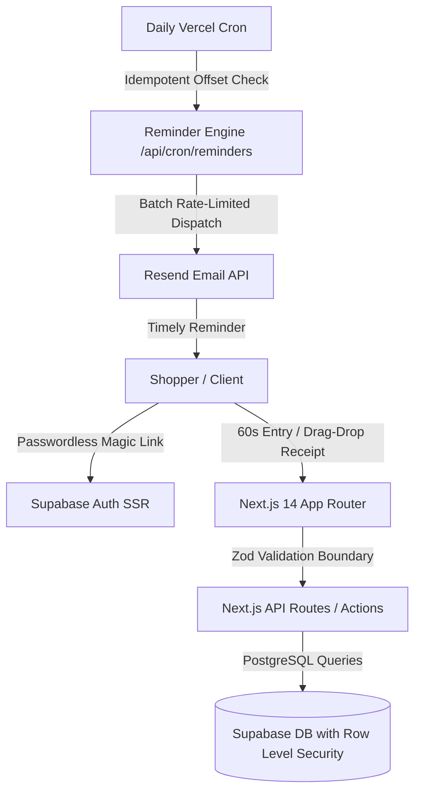

<div align="center">
  
  
  <p align="center">
    <strong>Never lose money to a missed return window.</strong>
  </p>

  <p align="center">
    A full-stack, consumer money-recovery system that captures purchases in under 60 seconds, calculates exact return deadlines, and sends timely reminders before return policies expire.
  </p>

  <p align="center">
    <a href="#-key-features">Features</a> •
    <a href="#-system-architecture">Architecture</a> •
    <a href="#-engineering-highlights">Engineering Highlights</a> •
    <a href="#-automated-tests">Testing</a> •
    <a href="PRODUCT_PROOF.md">Product Proof Document</a> •
    <a href="#-getting-started">Local Setup</a>
  </p>
</div>

---

## 🌟 Overview

Online shoppers lose hundreds of dollars every year simply because return policies (14, 30, 60, 90 days) are scattered, inconsistent, and invisible until it is too late.

**ReturnLoop** solves this by providing:
1. **60-Second Purchase Ingestion**: Pre-populated store chips (Amazon, Target, Apple, Zara, Nike, etc.) with instant policy estimates.
2. **Pure Calendar Deadline Engine**: Real-time date arithmetic with zero timezone drift.
3. **Urgency-Ranked Dashboard**: Clear chronological prioritization (*Overdue* $\rightarrow$ *Due today* $\rightarrow$ *Due in 1 day* $\rightarrow$ *Due in 3 days* $\rightarrow$ *Future*).
4. **Lifecycle Actions with 10s Undo**: Mark items *Returned* or *Kept* with optimistic UI updates and immediate undo protection.
5. **Money Recovered Metric**: Live aggregation of total dollars recovered from returned items.
6. **Automated Reminders Cron**: Background email dispatch at 7, 3, and 1-day deadline offsets.

---

## 🛠️ Tech Stack

| Layer | Technology | Purpose |
| :--- | :--- | :--- |
| **Frontend Framework** | **Next.js 14 (App Router)** | Server & Client Components, Server Actions, Dynamic Routing |
| **Language** | **TypeScript (Strict Mode)** | 100% type safety (`noImplicitAny`, zero `any`) |
| **Styling & Design** | **Tailwind CSS** | Design system tokens (Emerald `#15803D` & Zinc neutrals) |
| **Database & Auth** | **Supabase (PostgreSQL)** | Row Level Security (RLS) policies, Passwordless Magic Link auth |
| **Validation** | **Zod** | Schema boundary validation on all forms and API endpoints |
| **Email Service** | **Resend** | Transactional deadline reminder emails |
| **Icons & Brand** | **Lucide React & SVGs** | Clean, accessible, visual icon system |

---

## 🏗️ System Architecture



---

## 🧠 Key Engineering Highlights

### 1. Pure Calendar Date Arithmetic (Zero Timezone Shift)
Standard JavaScript `Date.toISOString()` causes month-end and leap-year shifts when running across different international time zones. ReturnLoop implements a pure string arithmetic date engine (`YYYY-MM-DD`) in [`lib/deadlines.ts`](lib/deadlines.ts) that guarantees exact deadline calculation regardless of the client's UTC offset.

### 2. Multi-Tenant Security via PostgreSQL Row Level Security (RLS)
Security is enforced at the database layer rather than relying solely on application middleware. Every table (`profiles`, `purchases`, `reminders`, `ai_extractions`) has granular RLS policies ensuring that users can only ever select, insert, or modify their own authenticated records.

### 3. Pragmatic, Responsible AI Ingestion
Rather than building an unreliable chatbot, AI is applied strictly as invisible infrastructure for receipt image parsing with a **mandatory human review dialog**. Zero data is saved automatically without explicit user verification, and the system gracefully falls back to manual entry on timeouts or quota limits.

### 4. Optimistic UI with 10-Second Undo Safeguard
Status changes (*Returned*, *Kept*, *Reactivate*) update the UI instantly while triggering a 10-second toast with an **Undo** button, preventing data loss from accidental taps on mobile devices.

---

## 🧪 Automated Tests

ReturnLoop is covered by an automated test suite verifying all critical business logic:

```bash
node --test tests/deadlines.test.js tests/core-workflow.test.js tests/reminders.test.js tests/ai-extraction.test.js
```

```text
✔ AC-AI-5: File type validation rejects PDF and GIF files
✔ AC-AI-5: File size validation rejects files over 4 MB
✔ AC-AI-2: AI output parser extracts structured fields with mandatory human review
✔ AC-AI-4: Daily rate limit caps at 5 extractions per user per day
✔ AC-ADD-2: Missing store rejects purchase creation
✔ AC-ADD-3: Valid store and date calculates correct deadline
✔ AC-ADD-5: Changing return window to 14 days calculates exact date
✔ AC-DASH-2: Purchases sort by soonest deadline first
✔ AC-DATA-3: Soft delete and restore lifecycle preserves data
✔ Deadline calculation with 30-day window
✔ Deadline calculation crossing month boundary
✔ Deadline calculation crossing year boundary
✔ Deadline calculation during leap year (2028-02-20 + 10 days)
✔ Deadline calculation 1-day minimum and 365-day maximum
✔ Urgency evaluation: Overdue, Due today, 1 day, 3 days, 7 days, and future
✔ Urgency evaluation: Returned and Kept items
✔ Reminder offsets calculation (d7, d3, d1)
✔ AC-REM-1: Purchase with deadline in 7 days evaluates to d7 reminder
✔ AC-REM-1: Purchase with deadline in 3 days evaluates to d3 reminder
✔ AC-REM-1: Purchase with deadline tomorrow evaluates to d1 reminder
✔ AC-REM-2 & 5: Purchases with non-reminder offsets return null
✔ Recovered amount summary correctly aggregates returned items
✔ AC-REM-4: Batch limit caps at 20 emails per cron run

ℹ Total Tests: 23 passed, 0 failed
```

---

## 📄 Complete Product Proof Document
For the in-depth 35-point product proof covering market research, technical trade-offs, UX rationale, and business model, see **[PRODUCT_PROOF.md](PRODUCT_PROOF.md)**.

---

## 💻 Local Setup & Development

### 1. Clone the repository
```bash
git clone https://github.com/your-username/returnloop.git
cd returnloop
```

### 2. Install dependencies
```bash
npm install
```

### 3. Configure environment variables
Copy the example environment file:
```bash
cp .env.example .env.local
```
Fill in your Supabase credentials in `.env.local`:
```env
NEXT_PUBLIC_SUPABASE_URL=your-supabase-url
NEXT_PUBLIC_SUPABASE_ANON_KEY=your-supabase-anon-key
SUPABASE_SERVICE_ROLE_KEY=your-supabase-service-role-key
NEXT_PUBLIC_APP_URL=http://localhost:3000
CRON_SECRET=your-random-cron-secret
```

### 4. Run the database migration
Execute the SQL statements in [`DATABASE_SCHEMA.sql`](DATABASE_SCHEMA.sql) in your Supabase SQL Editor.

### 5. Start the development server
```bash
npm run dev
```
Open **[http://localhost:3000](http://localhost:3000)** in your browser.

---

## ⚖️ License
MIT License. Created with high engineering discipline.
